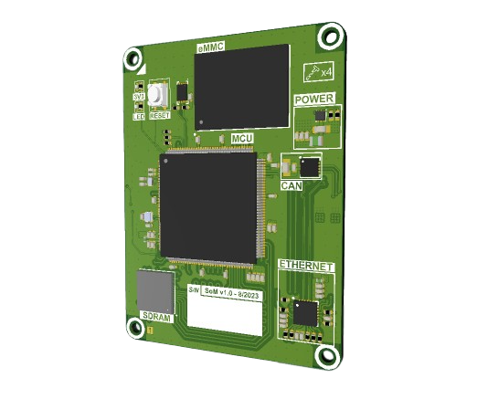
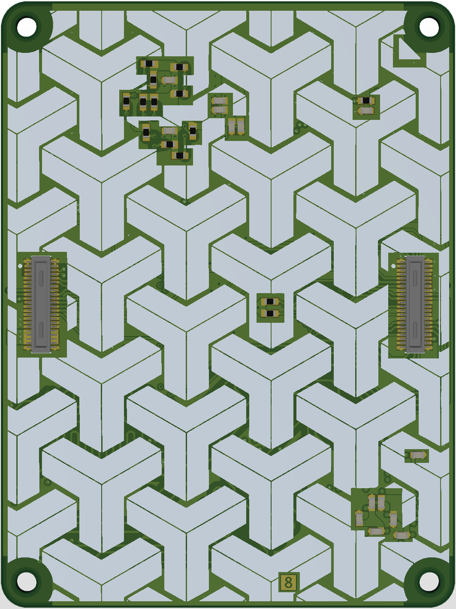

# SoM STM32F4

This System-on-Module provides a powerful platform with an STM32F429 extended by an SDRAM, eMMC and external peripherals like Ethernet and CAN Bus. 
The SoM plugs into a motherboard through its low-profile connectors.

The size of the board is 60mm x 45mm with an 8 layer stackup. 

## Components
- **MCU** - STM32F429ZET6TR
- **SDRAM** - AS4C8M16SA-6BINTR
- **eMMC** - IS21TF08G-JQLI
- **Secure Element** - ATECC608A-MAHDA-S
- **Ethernet** - LAN8720A-CP-ABC
- **CAN Bus** - LTC2875HDD#TRPBF

## Board Views
### Top View

### Bottom View

### Bottom Fancy View
